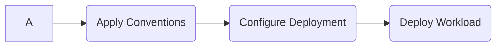

# Supply Chains

This package provides a few supply chains you can use as part of your golden paths to production.

### Supply Chain (Basic): Image-to-URL

The `image-to-url-basic` supply chain provides a simple path consisting of the following stages:

* Apply workload conventions based on language and framework;
* Define and configure the workload manifests with Knative;
* Deploy the workload using Crossplane.

